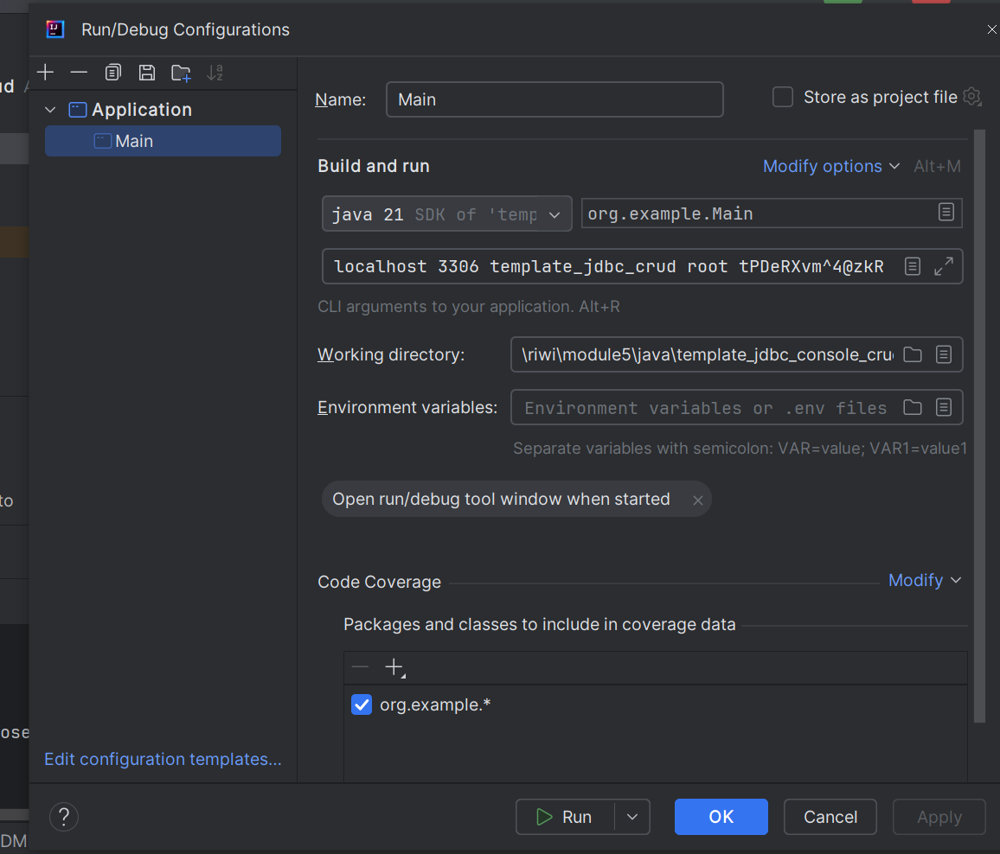

# Workshop JDBC + MySQL CRUD App

## Steps to run the project
1. From the `resources/` folder, copy the SQL in the `db.sql` file to set up the database.
2. Run the `main` function using the button provided by IntelliJ next to it, then configure the CLI parameters.
   > [!NOTE]
   > It's fine that an exception is raised when trying to connect to the database.

   

3. Set up the CLI parameters. Do not forget to click on "Apply".

   

4. Run again the `main` function.